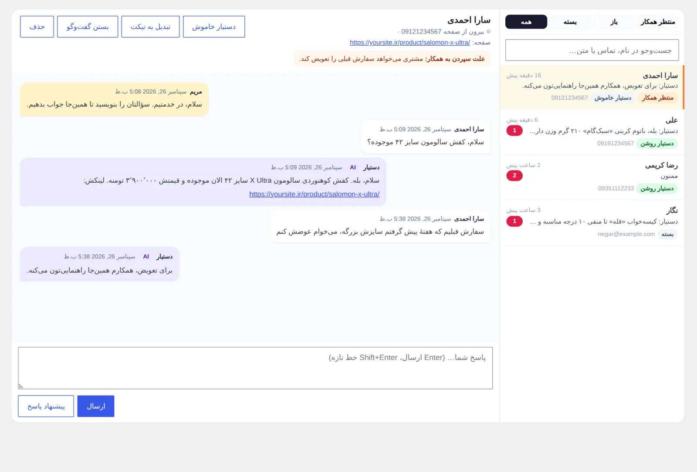
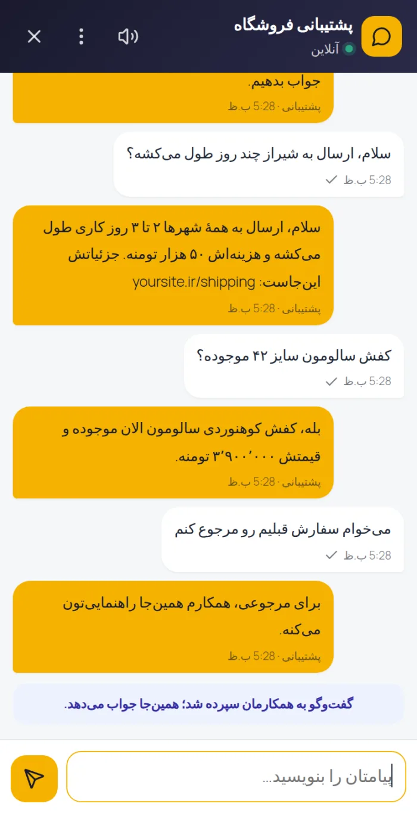
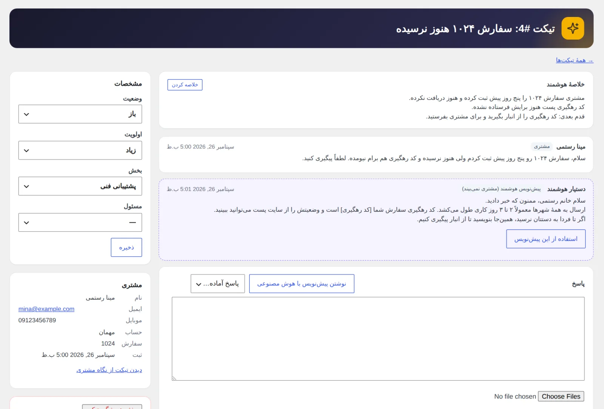
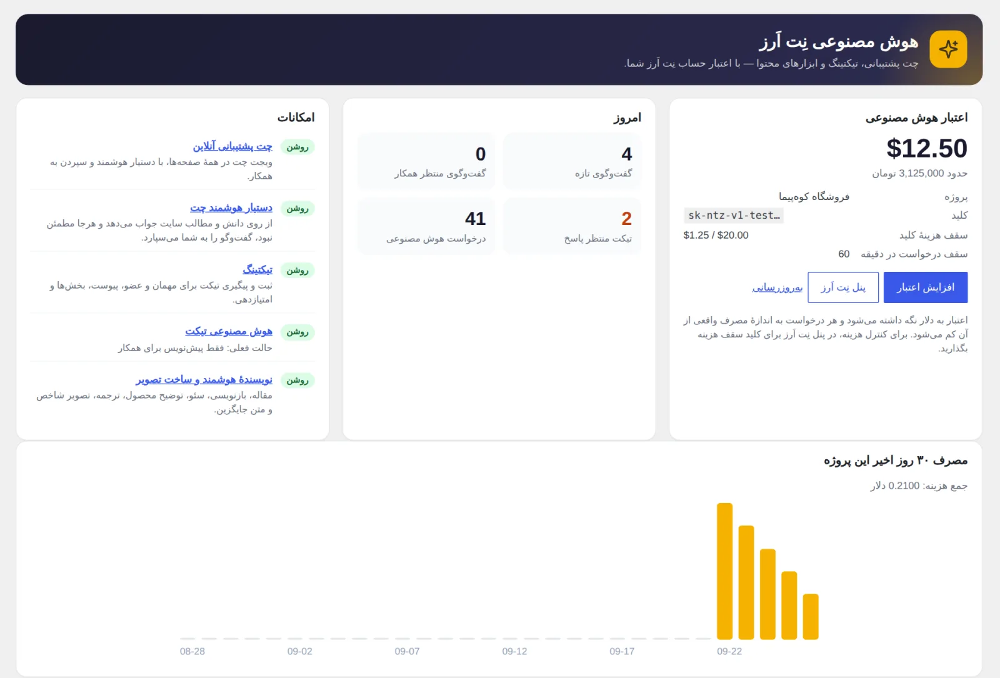
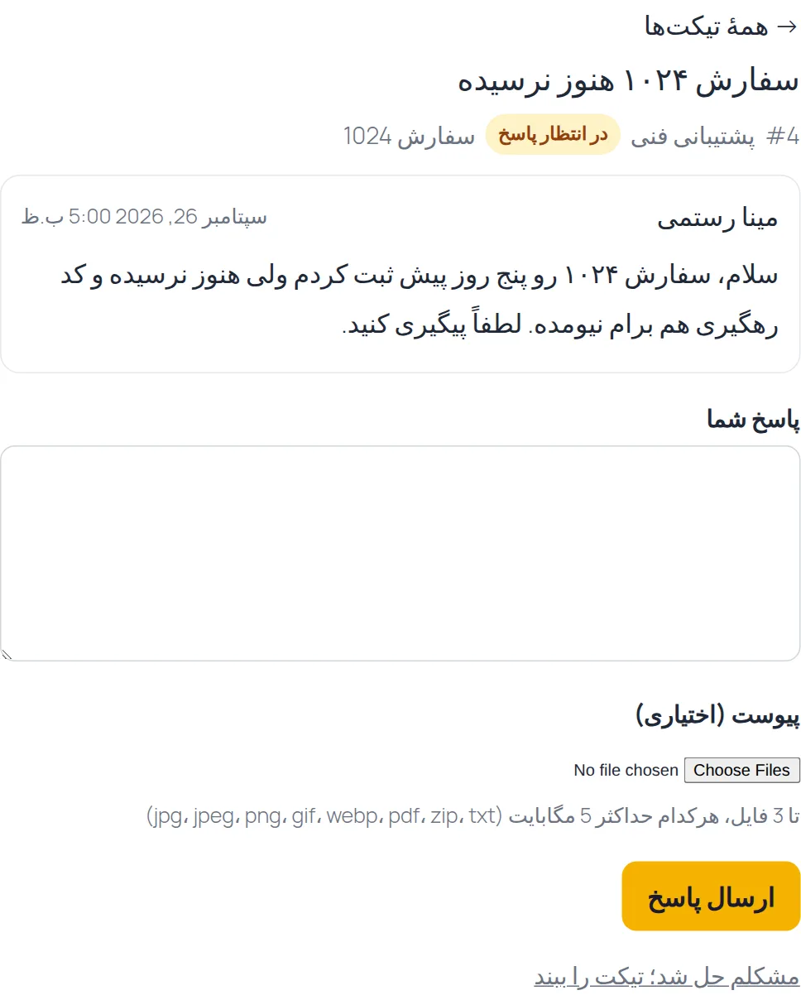
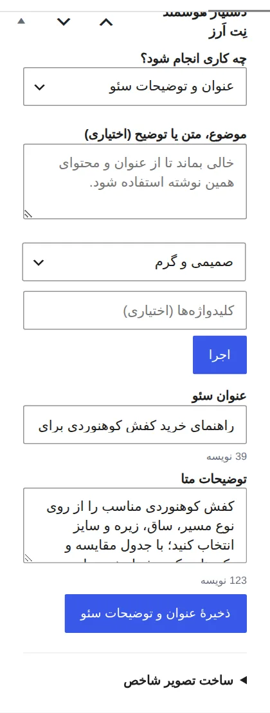

# هوش مصنوعی نِت اَرز برای وردپرس

افزونهٔ متن‌باز وردپرس که چت پشتیبانی هوشمند، تیکتینگ و ابزارهای نوشتن را با **یک کلید API نِت اَرز** به سایت شما می‌آورد. همهٔ درخواست‌های هوش مصنوعی از سرور سایت شما مستقیم به [API هوش مصنوعی نِت اَرز](https://netarz.ir/ai-api) می‌رود و هزینه‌اش از اعتبار همان حساب کم می‌شود؛ حساب جداگانه در OpenAI یا سرویس دیگری لازم نیست.

- وردپرس ۶٫۰ به بالا (روی ۷٫۱ آزمایش شده)، PHP ۷٫۴ تا ۸٫۴
- سازگار با ووکامرس (اختیاری)، ویرایشگر بلوکی و ویرایشگر کلاسیک
- مجوز: GPL-2.0-or-later
- صفحهٔ معرفی: [netarz.ir/ai-api/wordpress](https://netarz.ir/ai-api/wordpress?utm_source=github&utm_medium=referral&utm_campaign=netarz-ai-wordpress) · راهنمای کامل نصب و تنظیم: [netarz.ir/docs/ai/wordpress](https://netarz.ir/docs/ai/wordpress?utm_source=github&utm_medium=referral&utm_campaign=netarz-ai-wordpress)

## نمای افزونه

| صندوق گفت‌وگو در پیشخوان | ویجت چت روی موبایل |
|---|---|
|  |  |

| تیکت با پیش‌نویس و خلاصهٔ هوشمند | پیشخوان اعتبار و مصرف |
|---|---|
|  |  |

| تیکت از نگاه مشتری | دستیار نویسنده در ویرایشگر |
|---|---|
|  |  |

## چه امکاناتی دارد

### ۱. چت پشتیبانی آنلاین با دستیار هوشمند
- ویجت چت راست‌چین، سبک و بدون وابستگی؛ روی موبایل تمام‌صفحه باز می‌شود.
- دستیار از روی **دانش اختصاصی** که شما می‌نویسید و **مطالب همین سایت** (نوشته‌ها، برگه‌ها، محصولات ووکامرس با قیمت و موجودی) جواب می‌دهد و لینک صفحهٔ مرتبط را می‌گذارد.
- برای هر پیام تصمیم می‌گیرد: جواب بدهد، گفت‌وگو را **به همکار انسانی بسپارد**، یا (برای «ممنون» و «باشه») چیزی نگوید. اگر از جوابش کمتر از حد تعیین‌شده مطمئن باشد، جواب نمی‌دهد و گفت‌وگو را به شما می‌سپارد.
- چند پیام پشت‌سرهم یک جواب می‌گیرد، نه چند جواب.
- صندوق گفت‌وگو در پیشخوان: فیلتر «منتظر همکار»، جست‌وجو، پیشنهاد پاسخ با هوش مصنوعی، خاموش/روشن کردن دستیار برای هر گفت‌وگو، تبدیل گفت‌وگو به تیکت، تیک «دیده شد»، صدای پیام تازه.
- ساعت کاری، پیام خارج از ساعت کاری، پیام دعوت، رنگ و جای دکمه، پنهان‌کردن در صفحه‌های دلخواه، ایمیل اعلان.
- محافظ‌های هزینه: سقف پاسخ خودکار در هر گفت‌وگو و در روز، سقف شروع گفت‌وگو از هر اتصال، حداکثر طول پیام، و توقف خودکار دستیار وقتی اعتبار تمام می‌شود.

### ۲. تیکتینگ پشتیبانی
- کد کوتاه `[netarz_ai_tickets]` (برگه‌اش هنگام فعال‌سازی خودکار ساخته می‌شود) و زبانهٔ «پشتیبانی» در حساب کاربری ووکامرس.
- ثبت تیکت برای کاربر عضو و مهمان؛ مهمان با لینک مخصوصی که به ایمیلش می‌رود پیگیری می‌کند.
- بخش‌ها، اولویت، وضعیت، مسئول، یادداشت داخلی، پاسخ‌های آماده، امضا، انتخاب سفارش ووکامرس، بستن خودکار، امتیازدهی مشتری.
- پیوست فایل با نام تصادفی در پوشهٔ محافظت‌شده؛ فقط صاحب تیکت و همکاران به آن دسترسی دارند و فایل اجرایی پذیرفته نمی‌شود.
- هوش مصنوعی تیکت در سه حالت: خاموش، **پیش‌نویس خصوصی** برای همکار، یا **پاسخ خودکار** وقتی مطمئن است. خلاصهٔ هر تیکت با هوش مصنوعی، با یک دکمه.
- هوش مصنوعی در پس‌زمینه (WP-Cron) کار می‌کند تا مشتری بعد از فرستادن فرم منتظر نماند.

### ۳. نویسنده و ابزارهای محتوا
- جعبهٔ «دستیار هوشمند» در ویرایشگر (بلوکی و کلاسیک): نوشتن مقالهٔ کامل، سرفصل، بازنویسی، گسترش، کوتاه‌کردن، ویرایش املایی، ترجمه، خلاصه برای چکیده، پیشنهاد عنوان و برچسب، پرسش‌های متداول، متن شبکه‌های اجتماعی.
- عنوان و توضیحات سئو؛ اگر Yoast، Rank Math، AIOSEO یا SEOPress فعال باشد، در فیلدهای خود همان افزونه ذخیره می‌شود.
- توضیحات کامل و کوتاه محصول ووکامرس.
- صفحهٔ «نویسندهٔ هوشمند» برای ساخت پیش‌نویس تازه از یک موضوع.
- ساخت تصویر با هوش مصنوعی و ذخیرهٔ مستقیم در کتابخانهٔ رسانه یا تنظیم به‌عنوان تصویر شاخص.
- نوشتن متن جایگزین (alt) تصویر با مدل دیداری، از داخل پنجرهٔ رسانه.
- پیشنهاد پاسخ به دیدگاه‌ها در صفحهٔ دیدگاه‌ها.

### ۴. پیشخوان اعتبار و مصرف
- موجودی حساب نِت اَرز (دلار و معادل تقریبی تومان)، سقف هزینهٔ کلید اگر گذاشته باشید، نمودار هزینهٔ ۳۰ روز اخیر.
- هشدار کم‌شدن اعتبار و دکمهٔ افزایش اعتبار.
- گزارش محلی هر درخواست (امکان، مدل، توکن، شناسهٔ درخواست) — بدون ذخیرهٔ متن پیام‌ها.

## نصب

۱. آخرین نسخه را از [Releases](../../releases) دانلود کنید (یا مخزن را با نام پوشهٔ `netarz-ai` در `wp-content/plugins` قرار دهید) و افزونه را فعال کنید.
۲. در [netarz.ir/ai](https://netarz.ir/ai) اعتبار بخرید، یک پروژه بسازید و برای آن **کلید API** بگیرید (با `sk-ntz-v1-` شروع می‌شود). برای این کلید سقف هزینه بگذارید تا خرج از حدی که می‌خواهید بالاتر نرود. تا احراز هویت نکرده‌اید، سقف مصرف حسابتان ۲ دلار است.
۳. در پیشخوان وردپرس به «هوش مصنوعی ← تنظیمات» بروید، کلید را وارد و ذخیره کنید. افزونه اتصال را آزمایش می‌کند و موجودی را نشان می‌دهد.
۴. در تب «چت پشتیبانی» ویجت را روشن کنید و در «دانش اختصاصی» اطلاعاتی را که دستیار باید بداند بنویسید: شرایط ارسال، روش‌های پرداخت، ساعت کاری، راه‌های تماس و پرسش‌های پرتکرار.

## هزینه

خود افزونه رایگان و متن‌باز است. هر درخواست هوش مصنوعی به اندازهٔ مصرف واقعی از اعتبار حساب نِت اَرز شما کم می‌شود. فهرست مدل‌ها و قیمت هر کدام در [netarz.ir/ai-api/models](https://netarz.ir/ai-api/models) آمده و در تنظیمات افزونه هم کنار هر مدل دیده می‌شود. مدل هر بخش (چت، تیکت، نویسنده، تصویر، متن جایگزین) را جدا انتخاب می‌کنید.

## حریم خصوصی و امنیت

- کلید API فقط روی سرور شما ذخیره می‌شود و هیچ‌وقت به مرورگر بازدیدکننده نمی‌رسد.
- برای پاسخ‌گویی، متن پیام و بخش‌های مرتبط از مطالب منتشرشدهٔ سایت به API نِت اَرز می‌رود. نوشته‌های پیش‌نویس، خصوصی یا رمزدار فرستاده نمی‌شود.
- نِت اَرز متن درخواست و پاسخ را ذخیره نمی‌کند و فقط اطلاعاتی مثل مدل، تعداد توکن و هزینه را نگه می‌دارد. متن عیناً به شرکت سازندهٔ مدل (مثلاً OpenAI) می‌رسد و از آن‌جا سیاست همان شرکت حاکم است.
- نشانی IP بازدیدکننده فقط به‌صورت درهم‌سازی‌شده و برای جلوگیری از سوءاستفاده نگه داشته می‌شود.
- با ابزارهای حریم خصوصی وردپرس (ابزارها ← خروجی/پاک‌کردن داده‌های شخصی) می‌توانید گفت‌وگوها و تیکت‌های یک ایمیل را بگیرید یا پاک کنید.
- با حذف افزونه، داده‌ها فقط وقتی پاک می‌شود که در «تنظیمات ← پیشرفته» خودتان این را خواسته باشید.

## برای توسعه‌دهنده‌ها

| هوک | نوع | کاربرد |
|---|---|---|
| `netarz_ai_chat_visible` | فیلتر | `false` برگردانید تا ویجت در این درخواست نمایش داده نشود |
| `netarz_ai_chat_started` | اکشن | گفت‌وگوی تازه شروع شد (`$chat`) |
| `netarz_ai_chat_handoff` | اکشن | گفت‌وگو به همکار سپرده شد (`$chat`, `$reason`) |
| `netarz_ai_ticket_created` | اکشن | تیکت تازه ثبت شد (`$ticket`) |

- هر عنصری با ویژگی `data-netarz-chat` یا لینک `#netarz-chat` پنجرهٔ چت را باز می‌کند؛ از جاوااسکریپت هم `window.NetarzAIChatOpen()`.
- مسیرهای REST زیر `netarz-ai/v1` هستند.
- برای توسعهٔ محلی می‌توانید با ثابت `NETARZ_AI_API_BASE` در `wp-config.php` یک سرور آزمایشی جای API نِت اَرز بگذارید. در سایت واقعی این ثابت را تعریف نکنید.

گزارش خطا و پیشنهاد را در [Issues](../../issues) بنویسید. Pull Request هم می‌پذیریم.

---

## English summary

**NetArz AI for WordPress** adds an AI live-support chat with human handoff, a full support-ticket system, and AI writing tools (articles, rewriting, SEO meta, WooCommerce product copy, images, alt text, comment replies) to any WordPress site. All AI requests go server-side to the [NetArz AI gateway](https://netarz.ir/ai-api) (OpenAI-compatible) and are billed to your NetArz credit — the API key never reaches the browser.

Requirements: WordPress 6.0+, PHP 7.4–8.4. WooCommerce optional. License: GPL-2.0-or-later.

Landing page: https://netarz.ir/ai-api/wordpress?utm_source=github&utm_medium=referral&utm_campaign=netarz-ai-wordpress — full guide (Persian): https://netarz.ir/docs/ai/wordpress?utm_source=github&utm_medium=referral&utm_campaign=netarz-ai-wordpress

Install: activate the plugin, create a project key at [netarz.ir/ai](https://netarz.ir/ai), paste it in **AI → Settings**, then enable the chat widget.
